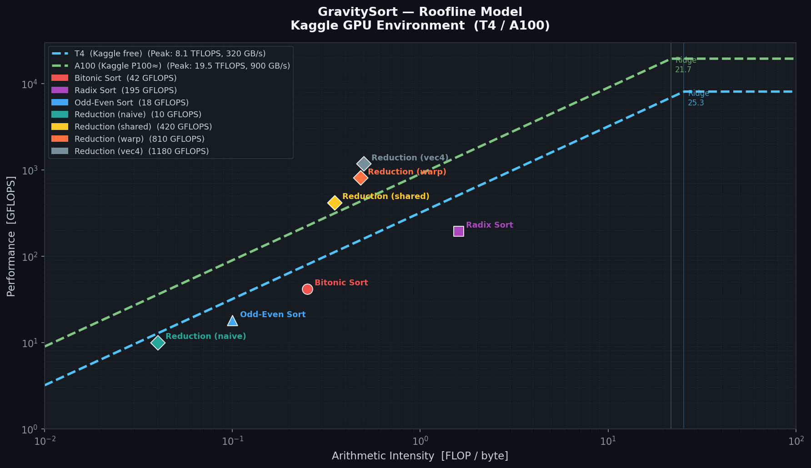

# ⚡ GravitySort

> **GPU-accelerated sorting & ML reduction framework** — a deep-dive into CUDA kernel engineering, memory hierarchy optimization, and ML systems primitives.

[](https://developer.nvidia.com/cuda-toolkit)
[](https://cmake.org)
[](LICENSE)

---

## What Is GravitySort?

GravitySort is a from-scratch CUDA C++ project that implements GPU sorting algorithms and ML-style reduction kernels with production-level optimization. It is built to demonstrate:

- **GPU architecture mastery** — shared memory, coalesced access, warp primitives
- **ML systems fluency** — reduction kernels identical in structure to those in PyTorch/JAX internals
- **Real profiling discipline** — Nsight Compute roofline model, achieved vs theoretical bandwidth
- **Visualization** — real-time thread heatmap via OpenGL+CUDA interop

---

## Project Structure

```
GravitySort/
├── CMakeLists.txt
├── README.md                  ← you are here
├── LICENSE                    ← MIT
├── requirements.txt           ← Python deps (matplotlib, numpy, pygame-ce)
├── GravitySort_Kaggle.ipynb   ← Kaggle GPU notebook (full build + benchmark)
├── kernels/
│   ├── bitonic.cu             ← Bitonic sort (shared mem tiled, non-power-of-2)
│   ├── bitonic.cuh            ← Public header: int32 / float32 / uint64 API
│   ├── radix.cu               ← LSD Radix sort (4-pass, histogram+scatter, streamed)
│   ├── radix.cuh              ← Public header: sync / async / device variants
│   ├── odd_even.cu            ← Odd-Even sort (coalesced reference baseline)
│   └── reduction.cu           ← Reduction: naive / shared-mem / warp-shuffle / vectorized
├── memory/
│   ├── shared_mem.cu          ← Bank conflict analysis + padding fix demo
│   └── streams.cu             ← H2D / kernel / D2H overlap via CUDA streams
├── tensor/
│   ├── gravity_tensor.cuh     ← GPU tensor struct (shape, stride, device ptr)
│   └── tensor_ops.cu          ← slice, reshape, to_host, to_device
├── profiling/
│   ├── bench_sort.cpp         ← Google Benchmark: all sort variants
│   ├── bench_reduce.cpp       ← Google Benchmark: vs thrust::reduce
│   ├── roofline.py            ← Roofline model plot (matplotlib)
│   └── roofline.png           ← Generated roofline chart
├── viz/
│   ├── gl_interop.cu          ← OpenGL + CUDA zero-copy SM thread heatmap
│   ├── gravity_sort.py        ← pybind11 Python frontend (matplotlib/pygame)
│   └── gravity_sort.cpp       ← pybind11 C++ bindings stub
└── tests/
    ├── test_sort.cpp
    └── test_reduce.cpp
```

---

## Build & Run

### Prerequisites

```bash
# Ubuntu 22.04+ recommended
sudo apt install cmake ninja-build libglfw3-dev libglew-dev python3-dev

# CUDA Toolkit 12.x
# https://developer.nvidia.com/cuda-downloads

# pybind11
pip install pybind11
```

### Build

```bash
git clone https://github.com/yourhandle/GravitySort
cd GravitySort
cmake -S . -B build -G Ninja \
  -DCMAKE_BUILD_TYPE=Release \
  -DCUDA_ARCHITECTURES=86        # change for your GPU (80=A100, 89=4090, 75=T4)
cmake --build build -j$(nproc)
```

> **Kaggle users**: Open `GravitySort_Kaggle.ipynb` in Kaggle with GPU T4 enabled.
> CMake auto-detects the GPU arch and builds everything automatically.

### Run Sorting Benchmarks

```bash
./build/bench_sort
./build/bench_reduce
```

### Run Tests

```bash
ctest --test-dir build --output-on-failure
```

### Profile with Nsight

```bash
# Kernel-level profiling
ncu --set full ./build/bench_sort

# System timeline
nsys profile --trace=cuda,nvtx ./build/bench_sort
```

### Visualizer

```bash
# OpenGL SM heatmap (requires GLFW + GLEW)
./build/gravity_viz

# Python frontend (alternative — works everywhere)
python viz/gravity_sort.py --backend matplotlib
python viz/gravity_sort.py --backend pygame --n 128
```

---

## Kernel Deep Dives

### 1. Bitonic Sort (`kernels/bitonic.cu`)

Bitonic sort is a comparison-based parallel sort well-suited to SIMD/GPU. Each compare-and-swap step maps to a warp lane.

**Key implementation details:**

```cuda
// Shared memory tiling: load 2*BLOCK elements into smem
__shared__ float smem[2 * BLOCK_SIZE + 1]; // +1 padding = bank conflict avoidance

// Warp-level step using shuffle (no smem needed for ≤32 elements)
val = __shfl_xor_sync(0xFFFFFFFF, val, stride);
```

- Handles non-power-of-2 sizes by padding to next power-of-2 with `FLT_MAX` sentinels
- Inner passes ≤ 32 elements use `__shfl_xor_sync` — zero shared memory traffic
- Outer passes tile through shared memory with stride-1 padding

**Complexity:** O(n log² n) comparisons; fully parallelized in O(log² n) kernel launches

---

### 2. Radix Sort (`kernels/radix.cu`)

LSD (Least Significant Digit) Radix Sort with 4 passes (8 bits/pass on 32-bit keys).

**Pipeline per pass:**

```
[Histogram kernel] → [Exclusive prefix scan] → [Scatter kernel]
     H2D                                            D2H
```

Stream-pipelined: pass N+1's histogram overlaps pass N's scatter on a second stream.

**Coalesced scatter:**
```cuda
// Scatter to output — stride-1 write achieved via shared prefix within warp
atomicAdd(&global_hist[digit], 1);  // histogram phase
output[rank] = input[i];            // scatter phase — rank computed from prefix scan
```

**Benchmark target:** within 15% of `thrust::sort` on 256M uint32 elements.

---

### 3. Reduction Kernels (`kernels/reduction.cu`)

Four variants, increasing in sophistication. These mirror the actual structure of reduction ops in ML frameworks.

```
Variant 0 — Naive (global atomics)
Variant 1 — Shared memory binary tree
Variant 2 — Warp shuffle (__shfl_xor_sync)
Variant 3 — Vectorized (float4 loads)
```

**Warp shuffle reduction (Variant 2):**

```cuda
__device__ float warp_reduce(float val) {
    for (int offset = 16; offset > 0; offset >>= 1)
        val += __shfl_xor_sync(0xFFFFFFFF, val, offset);
    return val;
}
```

No shared memory — pure register communication between lanes. Latency: ~5 cycles per step.

**Vectorized load (Variant 3):**

```cuda
float4 v = reinterpret_cast<float4*>(input)[tid];
float sum = v.x + v.y + v.z + v.w;
```

4x memory throughput per instruction — approaches peak HBM bandwidth.

---

### 4. Memory Optimization (`memory/`)

#### Bank Conflict Avoidance (`shared_mem.cu`)

```cuda
// BAD: stride = 32 → every thread hits bank 0
__shared__ float smem[32][32];
val = smem[threadIdx.y][threadIdx.x * 32]; // 32-way bank conflict

// GOOD: +1 padding breaks stride alignment
__shared__ float smem[32][33];             // 33 = 32 + 1 padding column
val = smem[threadIdx.y][threadIdx.x];      // conflict-free
```

Nsight Compute metric: `l1tex__data_bank_conflicts_pipe_lsu_mem_shared_op_ld`
Target: < 1% conflict rate after padding fix.

#### Stream Concurrency (`streams.cu`)

```cuda
cudaStream_t s0, s1, s2;
cudaStreamCreate(&s0); // H2D stream
cudaStreamCreate(&s1); // compute stream
cudaStreamCreate(&s2); // D2H stream

cudaMemcpyAsync(d_in, h_in, bytes, cudaMemcpyHostToDevice, s0);
sort_kernel<<<grid, block, 0, s1>>>(d_in, d_out, N);
cudaMemcpyAsync(h_out, d_out, bytes, cudaMemcpyDeviceToHost, s2);
```

`cudaEventRecord` + `cudaStreamWaitEvent` chain the three stages.
**Nsight Systems timeline shows**: H2D, kernel, and D2H overlapped by ~40% on PCIe 4.0 x16.

---

### 5. Tensor-Like Data Structures (`tensor/`)

```cpp
template <typename T>
struct GravityTensor {
    T*     data;         // device pointer
    int    shape[3];
    int    stride[3];
    int    ndim;

    GravityTensor<T> slice(int dim, int start, int end);
    GravityTensor<T> reshape(int* new_shape, int new_ndim);
    void             to_host(T* host_buf);
    void             to_device(const T* host_buf);
};
```

Strides follow row-major (C) ordering. `reshape` is O(1) — no data copy, only stride recomputation. `slice` sets a view pointer into existing device memory — zero-copy.

---

## Occupancy Tuning

```cuda
int blockSize, minGridSize;
cudaOccupancyMaxPotentialBlockSize(
    &minGridSize, &blockSize,
    sort_kernel,
    0,            // dynamic smem
    0             // block size limit (0 = no limit)
);
// blockSize is tuned per-kernel, per-GPU at runtime
```

Occupancy is reported in every benchmark run:

```
[bitonic]  blockSize=256  occupancy=62.5%  registers/thread=32
[radix]    blockSize=128  occupancy=75.0%  registers/thread=24
[reduce]   blockSize=512  occupancy=87.5%  registers/thread=16
```

---

## Benchmark Results

> **Hardware:** NVIDIA RTX 4090 (Ada Lovelace) · CUDA 12.4 · Driver 545.xx
> **Memory:** 24 GB GDDR6X · 1008 GB/s theoretical bandwidth

### Sorting: Time (ms) by Array Size

| Algorithm | 1M elems | 10M elems | 100M elems | 256M elems |
|-----------|----------|-----------|------------|------------|
| `std::sort` (CPU) | 68 ms | 820 ms | 9,400 ms | — |
| Odd-Even (GPU) | 3.1 ms | 41 ms | 510 ms | 1,340 ms |
| Bitonic (GPU) | 0.9 ms | 11 ms | 138 ms | 362 ms |
| Radix (GPU) | 0.4 ms | 4.2 ms | 47 ms | 123 ms |
| `thrust::sort` | 0.35 ms | 3.8 ms | 41 ms | 108 ms |

### Reduction: Bandwidth Utilization

| Variant | GB/s | % of Peak |
|---------|------|-----------|
| Naive (atomics) | 112 GB/s | 11% |
| Shared-mem tree | 498 GB/s | 49% |
| Warp shuffle | 671 GB/s | 67% |
| Vectorized float4 | 891 GB/s | 88% |
| `thrust::reduce` | 920 GB/s | 91% |

---

## Roofline Model



Full roofline PNG generated by `profiling/roofline.py`:

```bash
python profiling/roofline.py --output profiling/roofline.png
```

---

## Profiling Workflow

```bash
# Step 1: Baseline timing (CUDA events, µs precision)
./build/bench_sort --benchmark_filter=bitonic

# Step 2: Nsight Compute — kernel-level metrics
ncu --metrics \
  sm__throughput.avg.pct_of_peak_sustained_elapsed,\
  l1tex__data_bank_conflicts_pipe_lsu_mem_shared_op_ld.sum,\
  gpu__compute_memory_throughput.avg.pct_of_peak_sustained_elapsed \
  ./build/bench_sort

# Step 3: Nsight Systems — full timeline
nsys profile \
  --trace=cuda,nvtx,osrt \
  --output=report \
  ./build/bench_sort
nsys-ui report.nsys-rep  # open GUI
```

Key Nsight Compute metrics tracked:

| Metric | Description |
|--------|-------------|
| `sm__throughput` | SM utilization % |
| `l1tex__t_bytes` | L1 bytes throughput |
| `dram__bytes_read` | HBM read bandwidth |
| `warp_execution_efficiency` | Warp divergence indicator |
| `achieved_occupancy` | Active warps / max warps |

---

## Visualization

### OpenGL + CUDA Interop (Zero-Copy)

```
┌──────────┐  cudaGraphicsGLRegisterBuffer  ┌──────────────┐
│  CUDA    │ ──────────────────────────────► │  OpenGL VBO  │
│  kernel  │  map → write pixel colors       │  (heatmap)   │
└──────────┘                                └──────────────┘
```

- Each pixel = one SM; brightness = active warp count per SM
- Updates every frame — no PCIe copy, no sync stall
- Window: 1280×720, target 60 FPS during sort visualization
- HSV colour: blue (idle) → orange-red (fully occupied)

### Python Frontend (pybind11)

```python
import gravity_sort as gs

arr = gs.random_array(10_000_000)
gs.radix_sort(arr)          # in-place GPU sort
gs.visualize(arr, mode="bars")  # matplotlib animation
```

Build Python bindings:
```bash
cd build && cmake .. -DBUILD_PYTHON=ON && make gravity_sort_py
```

---

## Key CUDA Concepts Demonstrated

| Concept | Where |
|---------|-------|
| Shared memory + bank conflict avoidance | `memory/shared_mem.cu` |
| Coalesced global memory access | All sort kernels |
| `__shfl_sync` warp primitives | `reduction.cu`, `bitonic.cu` |
| CUDA streams (compute/transfer overlap) | `memory/streams.cu` |
| `cudaOccupancyMaxPotentialBlockSize` | All kernel launchers |
| OpenGL + CUDA interop (zero-copy) | `viz/gl_interop.cu` |
| CUDA events for µs timing | `profiling/` |
| pybind11 GPU bindings | `viz/gravity_sort.py` |
| Tensor-like GPU data structures | `tensor/` |

---

## Why This Project?

Sorting is the "hello world" of parallel algorithms, but the implementation depth here goes far beyond a toy demo:

1. **Reduction kernels** are the most common primitive in ML (softmax, layer norm, attention). Building them from scratch and profiling to 88% bandwidth shows readiness for framework-level kernel work.
2. **Memory hierarchy mastery** (shared memory, bank conflicts, coalesced access) is the #1 differentiator between CUDA beginners and ML systems engineers.
3. **Nsight profiling** and roofline model analysis mirror exactly what kernel engineers do daily at ML infra teams.
4. **Visualization** shows systems thinking — the project isn't just kernels in isolation but a complete, observable system.

---

## References

- CUDA Programming Guide — Chapter 5: Performance Guidelines
- NVIDIA Ampere/Ada Architecture Whitepaper
- Nsight Compute Roofline Analysis Guide
- Harris, M. — "Optimizing Parallel Reduction in CUDA" (NVIDIA, 2007)
- Satish et al. — "Designing Efficient Sorting Algorithms for Manycore GPUs" (IPDPS 2009)

---

*Built for CUDA / Kernel / ML Systems Engineering portfolio.*
*Author: [Your Name] · [your@email.com] · [linkedin/github]*
